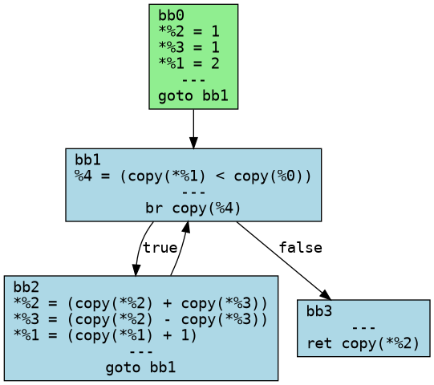

# UL MIR

Small proof of concept library for unilang's middle-level IR (MIR) 

## Quickstart
```
git clone https://github.com/Paul-Passeron/ul_mir.git
cd ul_mir
cargo build
cargo run --bin ul_test
```

## Example
### fibonnaci function

